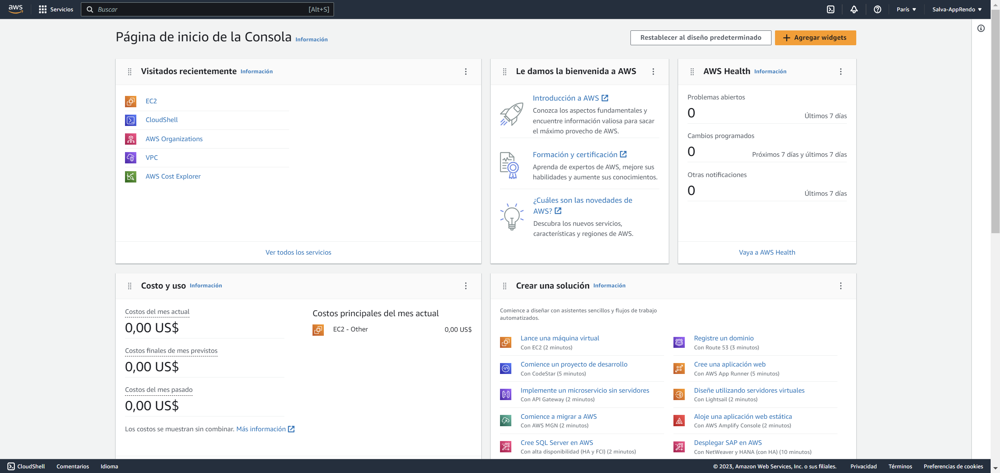
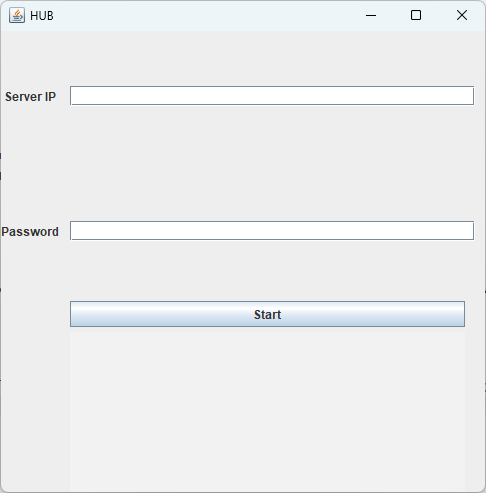
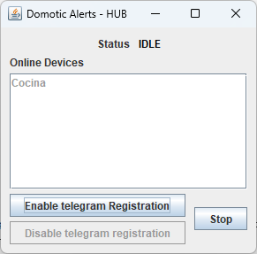
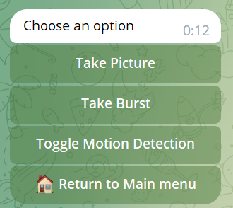
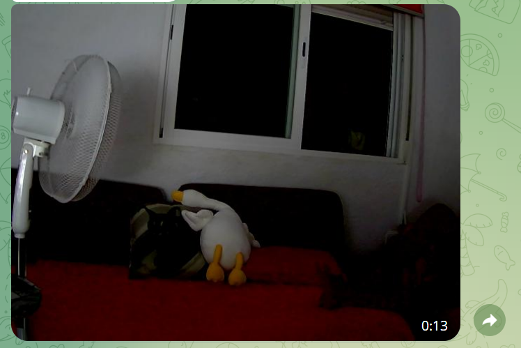
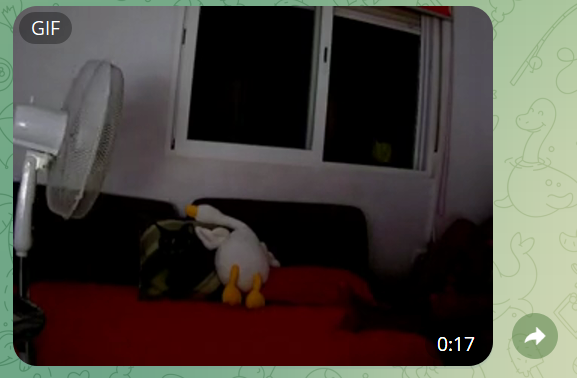
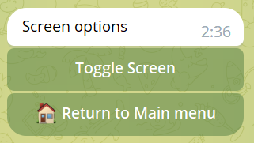
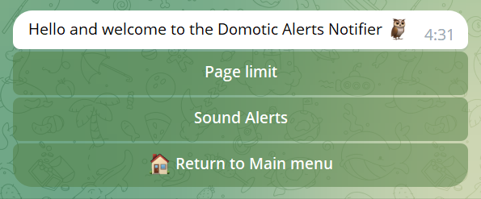

# Instalación y uso

En este capítulo se tratará el proceso de instalación del software y el
uso de este. Se explicarán los requisitos necesarios para poder
ejecutarlo, consideraciones a tener en cuenta, las distintas
posibilidades que ofrece y un ejemplo real.

## Instalación del software

### Requisitos

Primero los requisitos. La aplicación se ha desarrollado en Java, por lo
cual será necesario tener un entorno de desarrollo de Java, conocido
como JDK. En concreto, la versión 17 o superior. También será necesario
tener una carpeta llamada *temp* en el directorio donde se ejecute, así
como la carpeta data que se podrá descargar junto con los demás ficheros
necesarios en el repositorio del proyecto.

Para el correcto funcionamiento se debe utilizar Linux o Windows. Además
hay que tener en cuenta ciertos aspectos de la configuración del plan de
energía de los portátiles. En primer lugar, deben estar conectados a la
corriente eléctrica para que el sensor de batería funcione
correctamente, si se requiere que funcione. Luego, hay que desactivar
cualquier opción que haga que el dispositivo pase a estar apagado o
suspendido tras un tiempo de inactividad ya que perdería la conexión con
el resto de agentes. Finalmente, para que funcione correctamente los
avisos de corte de corriente es necesario disponer de un Sistema de
Alimentación Ininterrumpida, SAI. Este debe estar conectado al router
para mantener la conexión a internet el tiempo suficiente para mandar el
aviso al usuario por Telegram. Existe una alternativa al sistema de
alimentación y consiste en utilizar un portátil con capacidad de
conectarse a la red móvil o incluso utilizar un dispositivo móvil como
punto de conexión. De esta forma, si se produce un corte en la red
eléctrica, puesto que los puntos de acceso tienen batería, se podría
avisar al usuario.
En segundo lugar, es necesario crear un bot de Telegram. Para ello, es
necesario tener una cuenta de Telegram y hablar con @botfather, el bot
oficial para creación de bots, por redundante que pueda parecer. Al
empezar la conversación, sera el propio botfather el que explique los
diversos pasos necesarios para crear un bot. Estos son:

1.  Utilizar comando */newbot*

2.  Mandar nombre del bot. Este nombre se refiere al nombre en pantalla
    del bot. Será el que se verá a primera vista en la app.

3.  Mandar el nombre de usuario del bot. Este debe ser único y acabar en
    <<bot>> para que sea válido. Será el que lo identifique y el que
    permite a los usuarios de la aplicación encontrarlo.

4.  El botfather responderá con las credenciales de acceso a la API. Es
    importante almacenar este token de acceso en un lugar seguro y
    protegido.

El nombre de usuario del bot y el token de
acceso serán necesarios más adelante para poder configurar el agente
Telegram del sistema, por lo que es importante no perderlos.
El usuario debe decidir si quiere utilizar una plataforma en la nube,
como, por ejemplo, AWS, Google Cloud o Azure; o si, por el contrario,
prefiere utilizar uno de los dispositivos del hogar como entorno de
ejecución de la plataforma de agentes JADE.
Por último, será necesario descargar los ficheros <<.jar>> del Hub y
del Controlador, junto con la carpeta *data* del repositorio del
proyecto. El repositorio se encuentra en
<https://github.com/PinGunter/TFG/> y los ficheros para descargar se
encuentran en el apartado de <<releases>>
(<https://github.com/PinGunter/TFG/releases>).

Finalmente se podrían resumir los requisitos en:

-   JDK 17 o superior

-   Carpeta de datos y temporal

-   Ficheros de Hub y Controlador

-   Bot de Telegram

-   Los dispositivos que se quieran utilizar

-   Instancia en la nube o dispositivo local para la plataforma de
    agentes.

### Instalación

Una vez se cumplen todos los requisitos, se procede con la instalación
del software. En primer lugar, se debe crear una carpeta donde se
deberán alojar lo siguiente, todo en la raíz de esta:

-   Carpeta `data`

-   Carpeta vacía `temp`

-   Archivo `.jar` del Hub o Controlador (según se quiera utilizar)

Para el hub es necesario configurar también las credenciales del bot de
Telegram. Para ello será necesario crear un archivo llamado `.env` y
rellenarlo con la siguiente información:

        TELEGRAM_BOT_TOKEN=
        TELEGRAM_BOT_NAME=

El nombre de usuario es aquel que se le indicó al botfather, el que
acaba en <<bot>>. El token es el que proporciona este cuando se crea
un bot.

Una plantilla del fichero `.env` se puede encontrar en el repositorio
indicado anteriormente. La plantilla se encuentra en el fichero
`.env.template`. Este fichero con las credenciales también debe estar en
la raíz junto con el resto de ficheros.
Con esto ya se tiene listo al concentrador y al controlador. El
siguiente paso es instalar e iniciar JADE. La plataforma de agentes,
como se ha mencionado anteriormente, se puede instalar en una instancia
en la nube o en local. Puesto que se recomienda utilizar un proveedor de
servicios en la nube, se indican los pasos para lanzar una instancia
gratuita de EC2 en AWS e instalar JADE ahí.

1.  Crear cuenta de AWS.
    <https://portal.aws.amazon.com/billing/signup#/start/email>

2.  Iniciar sesión y acceder a la consola de AWS.

    {#fig:aws1 width="textwidth"}

3.  Acceder al apartado de EC2

4.  Seleccionar <<Lanzar instancia>>

5.  Configurar la instancia con las necesidades que se tengan. Si se va
    a utilizar de forma única para este propósito se puede utilizar una
    instancia de tipo `t2.micro`, por ejemplo, para que resulte
    gratuito. El sistema operativo de la instancia debe ser Linux.

6.  El siguiente paso será crear un grupo de seguridad donde estará la
    instancia. Este grupo de seguridad debe permitir conexiones UDP y
    TCP desde el puerto 1099 y con cualquier origen.

    {#fig:aws2 width="textwidth"}

7.  Una vez se tiene configurado el grupo de seguridad toca iniciar
    JADE. Para ello hace falta conectarse a la instancia. Esto se puede
    hacer a través de la web de AWS o a través de SSH.

8.  Con acceso a la terminal de la instancia, podremos clonar el
    repositorio del proyecto (<https://github.com/PinGunter/TFG>) e
    iniciar JADE. Los comandos para esto serían:

            git clone https://github.com/PinGunter/TFG
            cd TFG/jade
            chmod +x ./startJade.sh
            ./startJade.sh

9.  Ya estaría iniciada la plataforma de agentes.

En caso de querer instalar la plataforma en cualquier dispositivo local
bastaría con realizar el paso 8 en la máquina correspondiente. En
cualquier caso, nube o equipo local, se debe apuntar la dirección IP
para más tarde poder conectar los agentes. Para este proyecto se ha
utilizado un dominio personalizado para no tener que recordar la
dirección IP de la instancia EC2.

## Manual de uso

### Inicio del sistema

#### Hub

El hub solo se puede lanzar desde la interfaz gráfica que incluye. Para
ejecutarlo, se puede hacer doble click en el archivo si el sistema
operativo es Windows o se puede lanzar desde la terminal de cualquier
S.O. con el siguiente comando:

        java -jar hub.jar

Al ejecutarse, se mostrará una ventana de configuración inicial. En esta se incluyen los campos necesarios
para lanzar el agente e iniciar el sistema domótico. Debajo de estos
campos se muestra un pequeño cuadro de texto para avisar de posibles
errores.

{#fig:pantallaHub
width="50%"}

{#fig:pantallaHub2 width="50%"}

En el campo de `Server IP` hay que establecer la dirección IP de la
máquina donde esté alojada JADE. En este caso, en la instancia de AWS.
En el campo de `Password` se debe introducir la contraseña que se quiera
utilzar para cifrar los mensajes. Es importante recordar la contraseña
ya que los demás agentes solo se podrán conectar a otros agentes que
compartan la misma contraseña. Es la que identifica a un hogar.
Una vez se pulse <<Start>> el agente intentará conectarse a la
plataforma de agentes. Si es exitoso pasará a la siguiente pantalla. En esta nueva escena, se podrán ver los
dispositivos conectados, así como habilitar el registro de usuarios para
el bot de telegram y detener el sistema. También se puede observar en la
parte superior un indicador del estado del agente.

{#fig:pantallaHub3
width="50%"}

**Importante**, es necesario hablar al bot antes de seguir adelante. Es
en este momento donde se debe escribir al bot que se haya creado
previamente con un `/start` y luego registrarse con el código de
verificación. Este paso solo se debe hacer una única vez por cada
usuario de Telegram que se quiera registrar o si se cambia la clave de
cifrado.

#### Controlador

Para lanzar el agente Controlador existen dos posibilidades.

1.  A través de la interfaz gráfica

2.  A través de la linea de comandos.

Esto es así con la idea de poder reutilizar al máximo los dispositivos
ya que podríamos tener un dispositivo con la pantalla rota, pero con el
resto de componentes completamente funcionales; hay que intentar
aprovechar el máximo los equipos antiguos, recordemos que uno de los
objetivos del proyecto es reducir el <<e-waste>>.
Si se decide utilizar la interfaz gráfica, esta se puede lanzar de la
misma forma que el Hub: haciendo doble click en ella en Windows o con el
siguiente comando:

        java -jar controller.jar

{#fig:pantallaCtrl1 width="80%"}

En la figura se pueden ver los distintos campos y
parámetros que se pueden configurar para lanzar el agente. En primer
lugar, están los campos de `Name`, `Server IP` y `Password`. Estos se
refieren a la conexión con los demás agentes. El nombre sirve para
identificarlo en Telegram y los otros dos valores significan lo mismo
que en el Hub: dirección IP de JADE y contraseña del hogar,
respectivamente.
En la parte derecha de la interfaz aparece una serie de
<<checkboxes>> para seleccionar las distintas capacidades que el
usuario desee que posea el equipo. También se incluye el campo de texto
en la parte inferior por si hubiera algún problema al conectarse y
avisar de este.

{#fig:pantallaCtrl2 width="80%"}

Una vez iniciado, se pasará a la siguiente pantalla. En esta, se
muestran tres aspectos: el estado del agente, un cuadro de texto para
posibles errores y un botón para desconectar el agente del sistema.

{#fig:pantallaCtrl3 width="60%"}

Por otra parte, si se decide utilizar la línea de comandos, se deberá
especificar todas estas opciones a través de argumentos del programa. El
comando sigue la siguiente sintaxis:

    java -jar controller.java -host <hostname> -pass <password> 
    -name <name> [-cam] [-micro] [-batt] [-screen] [-speak]

Los argumentos `-host`, `-pass` y `-name` son obligatorios puesto que
sirve para la comunicación con el resto de agentes. El resto de
parámetros indican qué capacidades se quiere que tenga.

-   `-cam` Para tener la cámara

-   `-micro` Para tener el micrófono

-   `-batt` Para el sensor de batería

-   `-screen` Para el agente pantalla

-   `-speak` Para habilitar los altavoces

Se puede ver en la figura que aunque se lance por línea de
comandos, se puede utilzar el agente pantalla. Esto podría parecer algún
fallo, pero de esta forma se permite lanzar a los agentes a través de
una conexión remota a través de SSH o similares. Así se podría agilizar
y orquestar el lanzamiento de los controladores para cada uno de los
dispositivos que se quieran utilizar, sin necesidad de ir uno a uno.

{#fig:pantallaCtrl4 width="textwidth"}

En cualquier caso, por línea de comandos o interfaz gráfica, el agente
se comporta de la misma forma.
Es recomendable iniciar el Hub antes que los controladores ya que, a
pesar de que no es estrictamente necesario que el concentrador esté
primero, si los controladores no encuentran al cerebro del sistema
durante el primer minuto se considerará como intento fallido.

{#fig:tg1 width="60%"}

### Interactuando con el sistema

La forma principal de interactuar con el sistema es a través del bot de
Telegram. Este ofrece una serie de comandos y de teclados interactivos
que proporcionan una interfaz al usuario. Los comandos son mensajes de
texto que se pueden mandar en cualquier momento y desencadenan una
acción, estos son:

-   `/start` Lanza el menú principal en cualquier momento.

-   `/register` Sirve para registrar al usuario en el sistema, es
    necesario incluir el código de verificación proporcionado por el
    hub. Su uso completo es `/register <codigo>`.

-   `/setpagelimit` Sirve para establecer el límite de elementos por
    página en la sección de dispositivos. Por defecto es 6, se utiliza
    como `/setpagelimit <numero>`, el número tiene que ser par entre 4 y
    12.

-   `/stop` Apaga el sistema de domótica.

A continuación se muestran los botones interactivos. Esta será la forma
principal de interactuar con el sistema. El bot se encarga de mostrar
una serie de botones que varían según el contexto y contenido. En primer
lugar está el menú principal. En este se
muestran tres opciones:

-   <<Show Devices>> : Muestra un listado de los dispositivos
    conectados al sistema.

-   <<Settings>> : Muestra la página de ajustes donde se podrán
    configurar ciertos parámetros.

-   <<Ackowledge all warnings>> : Sirve para reconocer todas las
    emergencias actuales al mismo tiempo.

#### Menú principal

Si se pulsa sobre este botón saldrá un listado de todos los dispositivos
conectados al sistema. Tiene un sistema de paginación en caso de que se
decidan conectar una cantidad considerable de máquinas.

{#fig:tg_devices width="60%"}

Sobre cada uno de estos dispositivos se puede pulsar para averiguar qué
capacidades tienen para posteriormente interactuar con sus debidos
sensores y actuadores.

{#fig:tg_devices2 width="60%"}

**Cámara**
Pulsando sobre la opción de <<CAMERA>> se despliega el siguiente menú. Aquí se encuentran tres opciones distintas:

{#fig:tg_cam1
width="60%"}

1.  Take picture
    Esta es una acción inmediata. Al seleccionarla, el agente cámara del
    dispositivo seleccionado toma una fotografía y la manda a través de
    Telegram.

    {#fig:tg_cam2
    width="80%"}

2.  Take burst
    La opción de tomar una ráfaga de fotos despliega dos menús
    posteriores que sirven para seleccionar el número de fotografías y
    el periodo entre la toma de estas.

    {#fig:tg_burst_1 width="60%"}

    {#fig:tg_burst_2 width="60%"}

    Una vez seleccionadas las preferencias, el agente mandará una
    animación en formato `gif` para poder apreciar más fácilmente el
    movimiento de la ráfaga.

    {#fig:tg_burst_3
    width="textwidth"}

3.  Toggle motion detection Esta última opción activa o desactiva la
    detección de imágenes en el dispositivo. En caso de que se active,
    la cámara comenzará a tomar fotografías de forma interna y a
    comparar sus diferencias. Si la diferencia entre cada imagen superar
    un cierto umbral, se manda una foto al usuario con la zona donde
    ocurre el movimiento marcada en verde.

    {#fig:tg_motion width="60%"}

**Pantalla**
La funcionalidad de este agente es bastante reducida, tan solo se
utiliza para encender o no la pantalla del dispositivo. La interfaz que
se muestra en Telegram es la siguiente. 
El resultado de activarlo es lanzar una ventana de color blanco que
ocupe el tamaño completo de la pantalla.

{#fig:tg_screen
width="60%"}

{#fig:tg_fullscreen width="textwidth"}

**Micrófono**
Este agente también posee sus propios submenús más complejos para
permitir más control sobre las grabaciones que se deseen realizar. En
primer lugar, está la opción de elegir una configuración de segundos
predeterminada. En este caso, será el propio agente el que mande el
audio de vuelta en cuanto llegue a la duración deseada.
La otra opción consiste en empezar y detener la grabación de forma
manual. En este caso el agente no enviará el audio hasta que el usuario
indique el fin de la grabación; o cuando esta llegue a un máximo de tres
minutos. Esto se hace así para evitar que, por accidente, se olvide
detener la grabación y evitar saturar los dispositivos y la red.

{#fig:tg_audio_menu width="60%"}

{#fig:tg_audio_10 width="60%"}

{#fig:tg_fullscreen width="60%"}

**Altavoces**
Los altavoces tienen dos funciones principales:

-   Reproducir alarmas sonoras
    Para este caso, hay dos formas de hacer que suenen. El primero, el
    usuario puede pulsar en el botón de <<SPEAKERS>> del teclado
    virtual de Telegram. Esto hará que suene la alarma en el dispositivo
    concreto donde se haya escogido.
    Por otra parte, si se produce una emergencia que requiera de alarma
    sonora, las emergencias de movimiento, por ejemplo; sonará la alarma
    en todos los altavoces conectados en el hogar.

-   Reproducir audios proporcionados por el usuario
    Para ello, el usuario debe proporcionar al bot de Telegram el audio.
    Esto se puede realizar a través de notas de voz, si se quisiera
    establecer una especie de comunicación bidireccional más natural. O,
    también puede mandar el fichero de audio que se quiera reproducir.
    Por ejemplo, otro tipo de alarma, un audio pregrabado, o incluso,
    alguna canción que las mascotas reconozcan.
    Cuando se manda el sonido al bot, este responderá preguntando acerca
    de si se quiere hacer que suene en un único dispositivo o si quiere
    que suene en todos a la vez.

{#fig:tg_speakers_option
width="60%"}

{#fig:tg_speakers_option2
width="60%"}

**Batería**
Este agente, tal y como se comentó en su descripción, es únicamente un
sensor. Por lo tanto, no se puede interactuar de forma directa con este,
no tiene acciones a realizar. Su única función es detectar un posible
corte de corriente. En caso de que pase, se lanza la emergencia. También
avisa al usuario de cuando vuelve la luz, si este no había aceptado la
emergencia.

{#fig:tg_batt_emergency
width="60%"}

#### Menú de ajustes

{#fig:tg_settings
width="60%"}

En este menú se encuentran dos ajustes principales: el límite de
elementos por página y las alertas sonoras. Si se pulsa sobre el primer
elemento, se informa sobre el límite actual y las indicaciones para
poder cambiarlo.

{#fig:tg_settings_1 width="60%"}

En el caso de la segunda opción, se pregunta al usuario si quiere tener
activas las alarmas sonoras automáticas. Si está activada, las
emergencias por detección de movimiento desencadenarán las alarmas en
los altavoces disponibles, en caso contrario no se hará.

{#fig:tg_settings_2 width="60%"}

### Modo emergencia

El modo emergencia es un estado alternativo al habitual del sistema. Se
activa cuando cualquiera de los sensores detecta posible evento
peligroso y mandan el aviso al usuario, pasando por el controlador y el
hub. En este modo el sistema solo admite dos posibles mensajes:

1.  Mensaje de aceptación de emergencias: la confirmación por parte del
    usuario de que es consciente de la situación y no es necesario
    avisarlo de nuevo hasta que ocurra un nuevo evento. También lo puede
    mandar el sensor que originó la alarma si detecta que ya no es
    necesario. Por ejemplo, se cortó la corriente pero volvió más tarde.

2.  Nuevas emergencias: se agregan a la lista de emergencias del hub.

Es por ello que es importante salir de este estado lo antes posible para
devolverle el resto de funcionalidad al sistema. Esta situación de
emergencia solo acaba cuando todas las emergencias del hub quedan
aceptadas por el usuario o canceladas por el sensor original.
La principal función del concentrador en este caso consiste en recordar
al usuario sobre las emergencias no reconocidas cada dos minutos.

## Ejemplo de uso

Para mostrar la mayoría de funcionalidad del proyecto, se relata a
continuación un posible ejemplo. También está disponible un vídeo para
poder ver el trabajo en funcionamiento.

<figure id="fig:video_demo">

<figcaption>Enlace al vídeo: <a
href="https://drive.google.com/file/d/13Wn1f7S4d5irN_5KRcEyL6ybi5RBI_eV/view?usp=sharing"
class="uri">https://drive.google.com/file/d/13Wn1f7S4d5irN_5KRcEyL6ybi5RBI_eV/view?usp=sharing</a></figcaption>
</figure>

*Salva se va de viaje este fin de semana. Va a estar fuera unos días y
decide vigilar su casa, nunca ha ocurrido nada, pero nunca se sabe
tampoco. Se pone a buscar por su hogar y encuentra 3 portátiles, de
cuando actualizó a uno más potente para la carrera, de cuando se le
rompió la bisagra de uno, de cuando se compró uno de segunda mano para
experimentar, etc.*

*Decide entonces montar el sistema de vigilancia doméstica. La configura
utilizando un servidor que ya tenía para otro proyecto. Pone un portátil
en el salón, otro en el patio y otro en su habitación; los puntos de
entrada y donde tiene cosas importantes. Copia los archivos a todos las
máquinas y enciende el sistema justo antes de irse. En el portátil del
patio no ha puesto el sensor de batería porque el portátil que ha
utilizado en esa estancia tiene la batería rota y se apagaría justo
cuando se fuera la luz, así que lo pone en los otros dos. El del salón
no tiene cámara así que no activa ese agente en ese dispositivo. En su
dormitorio activa todos los nodos de vigilancia ya que utiliza un
portátil más moderno que conserva toda su funcionalidad.*

*Enciende el sistema, configura Telegram y se va de casa, tranquilo
porque sabe que las comunicaciones están cifradas. Al salir hace una
prueba de cómo se escucha el micrófono del salón, el más cercano a la
entrada y pide un audio de 10 segundos durante el cual cierra la puerta
y comprueba que se escucharía si alguien intentara entrar.*

*Al principio, está más nervioso y consulta con frecuencia las cámaras y
audios de las distintas estancias. Se da cuenta de que al tener la
opción de detectar movimiento, no necesita hacer eso más.*

*Pasan los días y le llega un aviso de movimiento, se asusta. Abre la
aplicación de Telegram y comprueba que por suerte, solo era un pájaro
que se había colado en el patio. Aprovecha para probar el sistema de
alarma y decide mandar un audio para espantarlo. Comprueba con las
cámaras que ha funcionado todo bien.*

*Al día siguiente, recibe un aviso: se ha ido la luz. Se empieza a
preocupar, e intenta llamar a los vecinos para consultarlo. No lo cogen.
Al mirar al teléfono de nuevo, ve la notificación: la luz ha vuelto. No
hay de qué preocuparse, había sido un microcorte.*

*Finalmente, vuelve del viaje. Por suerte no ha ocurrido nada, pero ya
va más tranquilo teniendo un sistema en el que confiar.*
